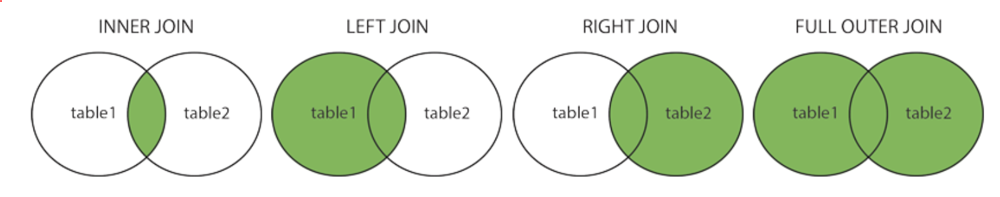
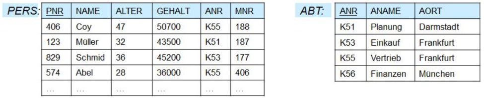

# SQL (Standard Query Language) Cheat Sheet

## Datentypen

| Datentyp               | Größe    | Beschreibung                                                  | Intervall                                                |
|------------------------|----------|---------------------------------------------------------------|----------------------------------------------------------|
| SMALLINT               | 2 bytes  | kleiner Intervall für Integer                                 | -32.768 bis +32.767                                      |
| INT                    | 4 bytes  | typische Wahl für Integer                                     | -2.147.483.648 bis +2.147.483.647                        |
| BIGINT                 | 8 bytes  | großer Intervall für Integer                                  | -9.223.372.036.854.775.808 bis +9223.372.036.854.775.807 |
| REAL                   | 4 bytes  | vergleichbar mit float in anderen Sprachen                    | 6 Dezimalstellen Genauigkeit                             |
| DECIMAL(a, b)          | variabel | mit a Stellen und b Nachkommastellen                          | bis 131072 vor Dezimalpunkt, bis 16383 nach Dezimalpunkt |
| NUMERIC(a, b)          | variabel | mit a Stellen und b Nachkommastellen                          | bis 131072 vor Dezimalpunkt, bis 16383 nach Dezimalpunkt |
| CHAR(n)                | variabel | für Strings fester Länge n                                    | 1 - 10.485.760                                           |
| VARCHAR(n)             | variabel | für Strings variabler Länge bis zu max. Länge n               | variabel                                                 |
| TEXT                   | variabel | für sehr große Strings geeignet                               | unendlich                                                |
| BOOLEAN                | 1 byte   | Datentyp mit zwei Zuständen (true/false)                      | TRUE, FALSE, NULL                                        |
| BIT(n)                 | variabel | für Bitfolgen                                                 | unendlich                                                |
| BIT(n) oder VARYING(n) | variabel | für Bitfolgen                                                 | unendlich                                                |
| DATE                   | 4 bytes  | für Datum-, Zeit- und kombinierte Datum-Zeit-Angaben geeignet | 4713 BC bis 5874897 AD                                   |
| BLOB                   | variabel | für sehr große binäre Dateien geeignet                        | unendlich                                                |

## CREATE
Erzeugt eine Tabelle
```sql
CREATE TABLE mitarbeiter
(
    id INT,
    vorname VARCHAR(20),
    nachname VARCHAR(20),
    geburtsdatum DATE,
    gehalt DECIMAL
);
```

## INSERT 
Fügt einer Tabelle Zeilen hinzu
```sql
INSERT INTO mitarbeiter VALUES 
    (1, 'Gordon', 'Freeman','1980-01-10', 100.0),
    (2, 'Isaac', 'Kleiner', '1950-05-14', 250.0);
```

## DROP TABLE 
Tabelle wird gelöscht. Wenn die Zeilen entfernt werden sollen, ohne die Tabelle zu löschen, sollte ```DELETE``` oder ```TRUNCATE``` verwendet werden. 

```sql
DROP TABLE mitarbeiter;
```

Es können auch mehrere Tabellen gelöscht werden

```sql
DROP TABLE tabelle1, tabelle2, tabelle3;
```

### RESTRICT
Tabelle wird nur gelöscht, wenn sie von keiner anderen referenziert wird
```postgres
DROP TABLE mitarbeiter RESTRICT;
```

### CASCADE
Gesamte Tabelle, sowie FK-Constraints der referenzierenden Tabelle(n) werden gelöscht
```postgres
DROP TABLE mitarbeiter CASCADE;
```

## ALTER TABLE

### Neues Attribut hinzufügen
```sql
ALTER TABLE mitarbeiter ADD anzahl_kinder INT;
```

### Attribut löschen
```sql
ALTER TABLE mitarbeiter DROP anzahl_kinder;
```

### Default-Wert festlegen
```sql
ALTER TABLE mitarbeiter ADD bonus DECIMAL DEFAULT 0.00;
```

## CONSTRAINTS

Statische Integritätsbedingungen auf Tabellen (bzgl. Attributen):

- **NOT NULL**: Verbot von Nullwerten
- **DEFAULT**: Standard-Werte
- **PRIMARY KEY**: Eindeutigkeit
- **FOREIGN KEY**: Fremdschlüssel
- **CHECK**: Nachbedingung

```sql
CREATE TABLE verlag
(
    id   INT,
    name VARCHAR(15),
    CONSTRAINT c_VerlagPK PRIMARY KEY (name)
);

CREATE TABLE buch
(
    isbn    CHAR(10) NOT NULL,
    auflage SMALLINT DEFAULT 1,
    jahr    INT NOT NULL,
    verlag_name  VARCHAR(15),
    CONSTRAINT c_buchPK PRIMARY KEY (ISBN, Auflage),
    CONSTRAINT c_checkAuflage CHECK (Auflage > 0),
    CONSTRAINT c_checkJahr (Jahr BETWEEN 1800 AND 2060)
);
```

```postgres
ALTER TABLE buch
    ADD CONSTRAINT c_buchFK FOREIGN KEY(verlag) REFERENCES verlag(name)
    ON DELETE RESTRICT ON UPDATE RESTRICT; /*man kann nichts an diesem FK ändern*/

ALTER TABLE buch 
    DROP CONSTRAINT c_checkJahr;
```

## TRUNCATE

- Löscht alle Zeilen, jedoch nicht die Tabelle selbst
- Berücksichtigt keine ```ON DELETE```-Trigger, kann also nicht für Tabellen angewandt werden , die von anderen Tabellen referenziert werden

```sql
TRUNCATE TABLE buch;
```

## SELECT
- Suchen von Informationen aus Tabellen
- Ergebnis ist wieder eine Tabelle (**Relation**)

### DISTINCT
bewirkt, dass doppelte Zeilen nicht in der Ergebnis-Tabelle erscheinen

```sql
SELECT DISTINCT nachname 
FROM mitarbeiter;
```

### AS 

ermöglicht das Umbenennen von Ergebnis-Spalten

```sql
SELECT vorname AS username 
FROM mitarbeiter;
```

### Arithmetische Operatoren
Hat einer der Operanden einen unbekannten Wert (=NULL), dann ist auch das Ergebnis der arithmetischen Operation unbekannt

```sql
SELECT id AS personalNr,
gehalt AS gehalt_alt,
gehalt * 1.05 AS gehalt_neu
FROM mitarbeiter;
```

### Skalare Ausdrücke

- numerischen Wertebereichen: etwa +, −, und /
- Strings: Operationen wie char_length (aktuelle Länge eines Strings), Konkatenation || und substring (Suchen einer Teilzeichenkette an bestimmten Positionen des Strings)
- Datumstypen und Zeitintervallen: Operationen wie current_date (aktuelles Datum),current_time (aktuelle Zeit), +, − und *

### IN

```sql
SELECT vorname, nachname
FROM mitarbeiter
WHERE geburtstag IN ('13.05.1970', '14.05.1980');
```

### IS NULL

```sql
SELECT * FROM mitarbeiter
WHERE id IS NULL
OR vorname IS NULL
OR nachname IS NULL;
```

### LIKE

```sql
SELECT vorname, nachname
FROM mitarbeiter
WHERE vorname LIKE 'Jenny%';
```

```sql
SELECT
	'foo' LIKE 'foo', -- true
	'foo' LIKE 'f%',  -- true
	'foo' LIKE '_o_', -- true
	'bar' LIKE 'b_';  -- false
```

### ORDER BY
```sql
SELECT vorname, nachname 
FROM mitarbeiter 
ORDER BY nachname;
```

mit Spaltenfunktion:

```sql
/*Sortiert alle Nachnamen absteigend nach Länge*/
SELECT nachname FROM mitarbeiter
ORDER BY LENGTH(nachname) asc;
```

## UPDATE
```sql
UPDATE mitarbeiter SET gehalt = 50.00 
WHERE nachname = 'Freeman';
```

```sql
UPDATE mitarbeiter SET gehalt = gehalt * 2 
WHERE vorname = 'Gordon';
```

## DELETE

Einzelne Zeile löschen
```sql
DELETE FROM mitarbeiter 
WHERE id = 123;
```

Alle Zeilen löschen, ohne Tabelle zu löschen

```sql
DELETE FROM mitarbeiter;
```

## JOIN
- **(INNER) JOIN**: Returns records that have matching values in BOTH tables
- **LEFT (OUTER) JOIN**: Returns all records from the LEFT table and the matched records from the RIGHT table
- **RIGHT (OUTER) JOIN**: Returns all records from the RIGHT table and the matched records from the LEFT table 
- **FULL (OUTER) JOIN**: Returns all recrords when there is a match in either LEFT or RIGHT table



### Beispiel

```sql
CREATE TABLE popular_films
(
    id INT PRIMARY KEY,
    name VARCHAR(100) NOT NULL
);

CREATE TABLE watchlist
(
    id INT PRIMARY KEY,
    name VARCHAR(100) NOT NULL
);
```

```sql
INSERT INTO popular_films VALUES
	(1, 'Arielle'),
  	(2, 'Pocahontas'),
  	(3, 'Mulan'),
  	(4, 'Aladin');

INSERT INTO watchlist VALUES
  	(5, 'Arielle'),
  	(6, 'Pocahontas'),
  	(7, 'Shrek'),
  	(8, 'Cars');
```

### INNER JOIN
```sql
SELECT * FROM popular_films 
INNER JOIN watchlist ON popular_films.name = watchlist.name;
```

```
| popular_films.id | popular_films.name | watchlist.id | watchlist.name |
|------------------|--------------------|--------------|----------------|
| 1                | Arielle            | 5            | Arielle        |
| 2                | Pocahontas         | 6            | Pocahontas     |
```

### LEFT JOIN
```sql
SELECT * FROM popular_films 
LEFT JOIN watchlist ON popular_films.name = popular_films.name;
```

```
| popular_films.id | popular_films.name | watchlist.id  | watchlist.name  |
|------------------|--------------------|---------------|-----------------|
| 1                | Arielle            | 5             | Arielle         |
| 2                | Pocahontas         | 6             | Pocahontas      |
| 3                | Mulan              | null          | null            |
| 4                | Aladin             | null          | null            |
```

### RIGHT JOIN
```sql
SELECT * FROM popular_films 
RIGHT JOIN watchlist ON popular_films.name = watchlist.name
```

```
| popular_films.id | popular_films.name | watchlist.id  | watchlist.name  |
|------------------|--------------------|---------------|-----------------|
| 1                | Arielle            | 5             | Arielle         |
| 2                | Pocahontas         | 6             | Pocahontas      |
| null             | null               | 7             | Shrek           |
| null             | null               | 8             | Cars            |
```

### FULL OUTER JOIN

```sql
SELECT * FROM popular_films 
FULL OUTER JOIN watchlist ON popular_films.name = watchlist.name
```

```
| popular_films.id | popular_films.name | watchlist.id  | watchlist.name  |
|------------------|--------------------|---------------|-----------------|
| 1                | Arielle            | 5             | Arielle         |
| 2                | Pocahontas         | 6             | Pocahontas      |
| 3                | Mulan              | null          | null            |
| 4                | Aladin             | null          | null            |
| null             | null               | 7             | Shrek           |
| null             | null               | 8             | Cars            |
```

### USING

The ```USING``` clause is a shortcut that allows you to take advantage of the specific situation where both sides of the join use the same name for the joining column(s). 

It takes a comma-separated list of the shared column names and forms a join condition that includes an equality comparison for each one. For example, joining ```T1``` and ```T2``` with ```USING (a, b)``` produces the join condition ```ON T1.a = T2.a AND T1.b = T2.b.```

```sql
SELECT * FROM popular_films INNER JOIN watchlist USING(name);
```

### Manueller Join

```sql
SELECT popular_films.name, watchlist.name
FROM popular_films popular_film, watchlist watchlist_film
WHERE popular_film.name = watchlist_film.name
AND popular_film.id = watchlist_film.id;
```

## Spaltenfunktionen
### COUNT
```sql
SELECT COUNT(*) AS anzahl_Mitarbeiter 
FROM mitarbeiter;
```

```sql
SELECT COUNT(DISTINCT vorname) AS distinct_vorname
FROM mitarbeiter;
```

### SUM
```sql
SELECT SUM(gehalt) AS summe_gehalt
FROM mitarbeiter;
```

### AVG
```sql
SELECT AVG(gehalt) AS avg_gehalt
FROM mitarbeiter;
```

### MIN
```sql
SELECT MIN(gehalt) AS max_gehalt
FROM mitarbeiter;
```

### MAX
```sql
SELECT MAX(gehalt) AS min_gehalt
FROM mitarbeiter;
```

## GROUP BY

Wenn man Spaltenfunktionen (z.B. ```SUM()```) nutzt und dabei noch andere Attribute haben möchte: 

```sql
/* funktioniert wie gewohnt */
SELECT COUNT(id) AS anzahl 
FROM popular_films; 
```

```sql
/* ohne GROUP BY würde es nicht funktionieren */
SELECT popular_films, COUNT(id) AS anzahl 
FROM popular_films 
GROUP BY id; 
```

## HAVING

Folgendes ist wichtig für ```GROUP BY```:
- ```WHERE``` filtert auf **Zeilenebene VOR** dem Gruppieren
- ```HAVING``` filtert auf **Gruppenebene NACH** dem Gruppieren

Beispiel:

```sql
SELECT vorname, nachname, AVG(gehalt) AS average
FROM mitarbeiter
WHERE geburtsdatum IN ('13.05.01','14.05.01') /*filtert alle Mitarbeiter mit Geburtstag am 13.5.01 und 14.05.01 VOR dem internen SORT und GROUP BY*/
GROUP BY nachname
HAVING AVG(gehalt) > 12000.0; /*filtert alle Nachnamen mit AVG(gehalt) > 12000 NACH dem internene SORT und GROUP BY*/
```
## Mengenoperationen

### INTERSECT
```sql
SELECT * FROM popular_films
INTERSECT
SELECT * FROM watchlist
```

### UNION
```sql
SELECT * FROM popular_films
UNION
SELECT * FROM watchlist
```

### EXCEPT

```sql
SELECT * FROM popular_films
EXCEPT
SELECT * FROM watchlist
```

## Geschachtelte Query 

```sql
SELECT vorname, nachname, gehalt 
FROM mitarbeiter
WHERE gehalt >
(SELECT max(gehalt) FROM mitarbeiter
WHERE vorname = 'Alexander');
```

```sql
SELECT per_nr, ab_datum
FROM abflug
WHERE f_bez
IN 
(SELECT f_bez FROM flug WHERE s_ort = 'Luxemburg');
```

# Fortgeschrittene Beispiele



Finden Sie alle Abteilungsorte
```sql
SELECT aort FROM abt;
```

Finden Sie alle Angestellten (PNR, NAME), deren Manager die 
Personalnummer 406 hat (MNR).
```sql
SELECT pnr, name 
FROM pers 
WHERE mnr = 406;
```

Finden Sie alle Angestellten (PNR, ALTER, NAME), 
die in einer Abteilung in Frankfurt arbeiten und 
eine Personalnummer zw. 100 und 800 haben, sowie 
ein Gehalt über 40k haben ODER 
unter 30 sind.
```sql
SELECT pnr, ALTER, NAME 
FROM pers 
INNER JOIN abt USING (anr)
WHERE 
(aort = 'Frankfurt' AND pnr BETWEEN 100 AND 800)
AND (gehalt > 40000 OR alter < 30);
```

Finden Sie die Personalnummer des Chefs der Personalnummer 574
```sql
SELECT mnr 
FROM pers 
WHERE pnr = 574;
```

Finden Sie alle Angestellten, deren Abteilungsort ein „a“ im Namen hat
```sql
SELECT * FROM pers 
INNER JOIN abt USING(anr)
WHERE abt.ort LIKE '%a%';
```

Finden Sie alle Abteilungsorte, an denen kein Mitarbeiter arbeitet.
```sql
SELECT aort 
FROM abt 
LEFT JOIN pers USING (anr)
WHERE pers.pnr IS NULL;
```

Finden Sie das durchschnittliche Gehalt aller Abteilungen
```sql
SELECT aname, AVG(gehalt) 
FROM abt 
INNER JOIN pers USING(anr) 
GROUP BY aname;
```
